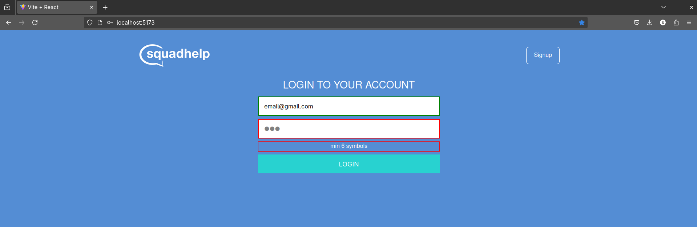
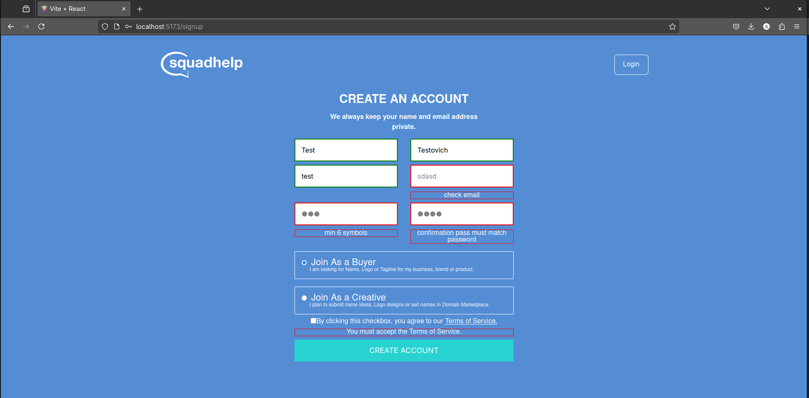
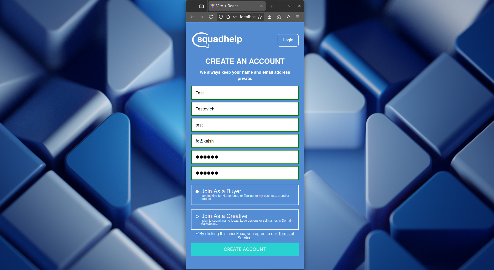

# 🔐 Authentication UI

This project provides authentication interfaces, including **Login** and **Signup** forms, built with React. It focuses on form validation, user experience, and clean UI design.

## 🚀 Features

- Real-time data validation for all input fields
- Error messages displayed beneath each field
- Dynamic styling based on validation status (valid/invalid)
- Page navigation using **React Router**

## 🛠 Tech Stack

- **React.js**
- **Formik**
- **Yup**
- **react-router-dom** (v6)
- **classnames**
- **SASS (SASS modules)**

## 📸 Screenshots






## 📦 Installation

```bash
git clone https://github.com/victoriastruk/forms-with-formik.git
cd forms-with-formik
npm install
npm run dev
```

## 📁 Folder Structure

```
forms-with-formik/
├── eslint.config.js
├── index.html
├── LICENSE
├── package.json
├── package-lock.json
├── public
│   └── vite.svg
├── README.md
├── src
│   ├── App.jsx
│   ├── assets
│   │   ├── adaptive-login.png
│   │   ├── adaptive-signup.png
│   │   ├── login.png
│   │   ├── react.svg
│   │   └── signup.png
│   ├── components
│   │   ├── forms
│   │   │   ├── Checkbox
│   │   │   │   ├── Checkbox.module.sass
│   │   │   │   └── index.jsx
│   │   │   ├── Input
│   │   │   │   ├── index.jsx
│   │   │   │   └── Input.module.sass
│   │   │   ├── LoginForm
│   │   │   │   ├── index.jsx
│   │   │   │   ├── LoginForm.module.sass
│   │   │   │   └── TitleForLogin
│   │   │   │       ├── index.jsx
│   │   │   │       └── TitleForLogin.module.sass
│   │   │   ├── RadioGroup
│   │   │   │   ├── index.jsx
│   │   │   │   └── RadioGroup.module.sass
│   │   │   └── SignupForm
│   │   │       ├── index.jsx
│   │   │       ├── SignupForm.module.sass
│   │   │       └── TitleForSignup
│   │   │           ├── index.jsx
│   │   │           └── TitleForSignup.module.sass
│   │   └── Header
│   │       ├── Header.module.sass
│   │       ├── index.jsx
│   │       └── logo.png
│   ├── index.css
│   ├── main.jsx
│   ├── pages
│   │   ├── LoginPage
│   │   │   └── index.jsx
│   │   ├── NotFound
│   │   │   ├── index.jsx
│   │   │   └── NotFound.module.sass
│   │   └── SignupPage
│   │       └── index.jsx
│   └── utils
│       └── validate
│           └── userSchema.js
└── vite.config.js
```

## 📜 License

This project is licensed under the MIT License - see the [LICENSE](LICENSE) file for details.

---

Made with ❤️ by Viktoriia Struk
